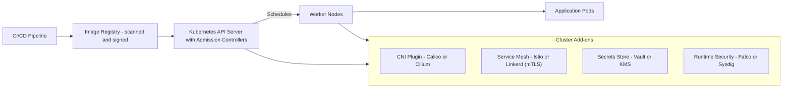

```mermaid
flowchart LR
  CI["CI/CD Pipeline"] --> Registry["Image Registry - scanned and signed"]
  Registry --> APIServer["Kubernetes API Server with Admission Controllers"]
  APIServer --> |Schedules| Nodes["Worker Nodes"]
  Nodes --> Pods["Application Pods"]

  subgraph Addons["Cluster Add-ons"]
    CNI["CNI Plugin - Calico or Cilium"]
    Mesh["Service Mesh - Istio or Linkerd (mTLS)"]
    Secrets["Secrets Store - Vault or KMS"]
    Runtime["Runtime Security - Falco or Sysdig"]
  end

  APIServer --> Addons
  Nodes --> Addons
```
